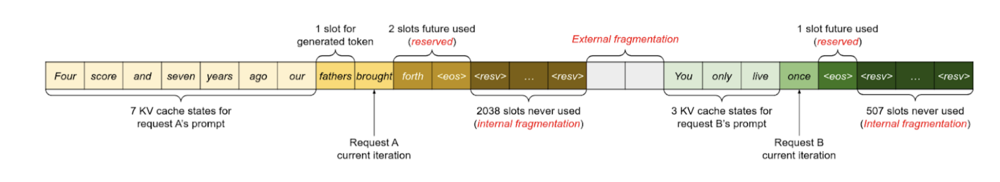
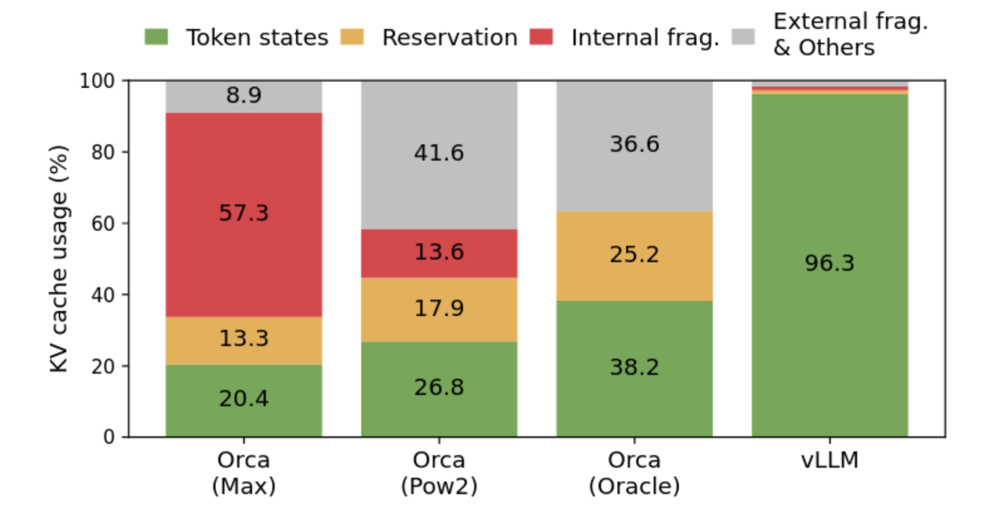
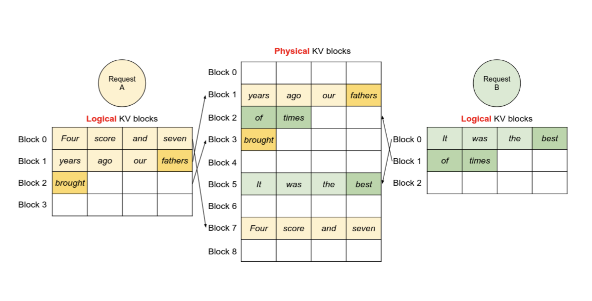
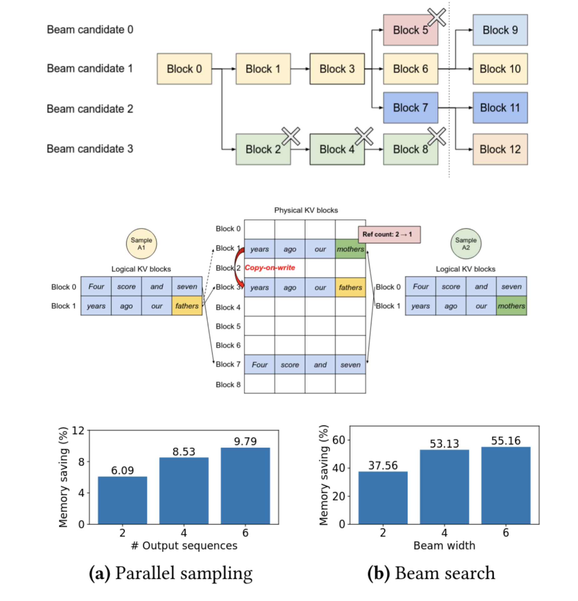
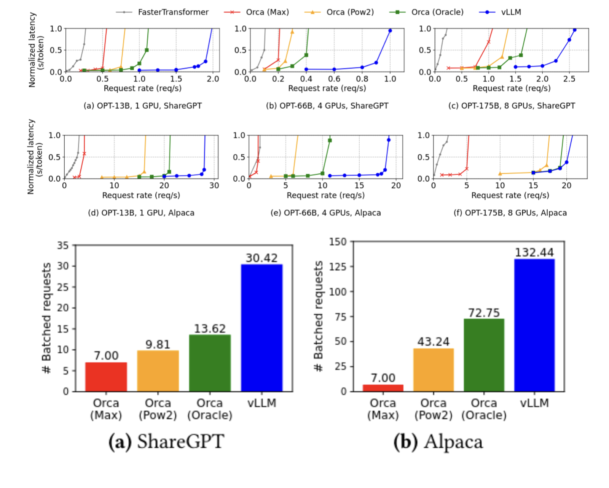

+++
title = "Efficient Memory Management for Large Language Model Serving with PagedAttention"
[extra]
bio = """ """
[[extra.authors]]
name = " Max Leibowitz (Presentor / Blogger)"
[[extra.authors]]
name = "Dustin (Presentor)"
[[extra.authors]]
name = "Donovan Burk (Blogger)"
+++

# How Transformers Work
Currently Large Language Models (LLMs) use transformer models as a way of advanced auto complete to generate large portions of text. They work primarily by referring to portions of texts (words and parts of words) as tokens. These tokens are then mapped to very high dimensional vectors, and then concatenated to form a matrix.This matrix is then multiplied by other matrices across stages of the LLM pipeline. Eventually it will resolve into a vector similar to the token vectors used as inputs, and the model will choose the token that it is most similar to. In order to generate large portions of text, this process is repeated, and the generated tokens are appended to the input matrix, until the model generates a termination token, meaning it wants to stop generating. The different values of the matrices in the layers are the model’s parameters which are trained to make the model perform as intended.

# Current Implementation
Current models take 10’s or even 100’s of Billions of parameters, which all have to be loaded into memory at the same time in order to have low latencies. In addition to this, input and output tokens have to be stored for repeated computations which can take hundreds of Bytes per token, with inputs and outputs anywhere from 100s to 100,000s requiring a lot of memory to be allocated. Currently this is all stored on the GPUs used to compute the output in video memory (VRAM). All of this memory usage has caused VRAM requirements to balloon massively. 

# Issues with Current Approaches
However, there are major concerns currently with how efficient the current LLM memory usage is. The system in the paper used 65% of memory as parameter data for the LLM. just above 30% was used for the KV cache, and the rest was for miscellaneous data. Obviously the parameter section is static and 100% efficient. However the KV cache is typically allocated as large chunks based on the maximum output of the LLM, which is highly inefficient since most requests don’t go anywhere near the maximum output limit. According to the paper current systems use the KV cache at 20-26% efficiency, while the current system under perfect condition can get up to 38% efficiency. However, not all KV is needed at once and is frequently refreshed at request chains start up and terminate. KV is instead filled up as tokens are generated which unfortunately are not predictable leading to the over allocation. But this data does not need to be contiguous which this paper hopes to exploit.

This graphic shows the fragmentation that can result from these naive allocation schemes.  Both internal fragmentation (cache memory allocated but never used) and external fragmentation (gaps between allocated chunks, too small to fit useful data in) result, leading to very poor memory use.  Even the state-of-the-art Orca method, augmented with unknowable future information about how many tokens the request will generate, fails to use more than 40% of its KV cache memory for storing actual data.

# PagedAttention Concept
The paper proposes a concept borrowed from operating systems: paging.  When an operating system kernel hands a process a contiguous block of memory, it’s often split between several parts of memory, or even swapped out to disk, and mapped back together into a single range using the virtual memory system.  The proposed system allocates the KV cache in fixed-size blocks, instead of in one monolithic chunk.  These fixed-size blocks are directly analogous to memory pages, and may be arranged however works best in the physical memory.  Like memory pages, these blocks are flexible, and need not be stored in GPU memory.  This almost entirely eliminates fragmentation, which allows their reference implementation (vLLM) to use its memory much more efficiently.  Less memory usage means more requests are handled at once, but it doesn’t improve the latency.  The approach generalizes to advanced decoding algorithms, with moderate improvements for generating multiple streams from the same prompt, and massive improvements for the beam search algorithm.

# Implementation Details

## Memory Management
PagedAttention’s memory management system is much simpler than OS pages, mostly because it’s all in software so it can be written for this single application.  vLLM does most of the memory management operations on the CPU, which dispatches jobs to worker GPUs.  The GPUs keep a copy of the block tables so the kernels can look up entries, and each GPU handles one or more attention heads.  If attention heads ever become too big to fit on a single GPU, then the PagedAttention approach will stop working.  If the system runs out of space on the GPU for more cache blocks, it can evict some of the cache to CPU memory.  The next time it’s needed, the swapped blocks are sent back over the PCIe link.  Another surprisingly usable technique is recomputation.  Instead of swapping blocks, they can simply be deleted, and the highly efficient prefill phase can recompute the data when needed.  This approach is often faster than swapping the blocks.

The blocks themselves, as mentioned, hold a fixed number of tokens.  Several block sizes were tested, and the authors found that 16 tokens was about the right size.  The blocks are always filled sequentially, and never emptied, so the block tables include both the address and the number of full tokens.  The blocks also have a reference count, so multiple streams can share a single block.  If they write different things, it copies the block and adjusts the refcount accordingly.

## Attention Blocks
The attention blocks in existing implementations work as you would expect from the math, on the whole input at once.  This requires the KV cache to be laid out contiguously.  To add this flexibility, the authors rewrote the GPU kernels that compute attention, changing them to support this block architecture.  This means that the kernels must look up addresses in a central block table, because the GPU doesn’t support virtual memory in hardware.  This lookup is expensive, increasing the attention latency by 20-26%.  Future GPU hardware could perhaps add virtual memory support to eliminate this penalty, but this has questionable utility for non-transformer tasks.  To reduce overhead with this new architecture, they fused the block read and attention kernels, and fused a few other ones for memory write and copy operations.

## Decoding Methods
PagedAttention works well for regular generation (run the transformer, pick a token, feed it back, and run it again), but it really shines when generating multiple parallel output streams.  The paper covers two approaches: multiple sampling and beam search.  Multiple sampling is simply taking the same prompt and picking, say, 4 different tokens to continue with immediately after the prompt, leading to 4 different outputs.  PagedAttention can share the prompt state between all of the streams using the refcounting, which reduces the size of the cache.  Beam search shows more dramatic improvements.  In beam search, several candidates are tracked, again say 4.  After each token, the stream can be forked to explore another generation path, and if there are too many streams then an old one will be deleted.  This is a very similar pattern to the familiar Unix fork/kill process lifecycle, and just like in Unix, virtual memory and copy-on-write bring massive performance gains.  Forking a candidate is nearly free, because it can reuse all previous cache blocks.  One block might have to be copied to avoid overwriting another generation, but the blocks are relatively small so it’s still very cheap.  Killing a candidate is similarly inexpensive, because it just has to decrement the refcounts and free any now-unused blocks.  The enormous gains in beam search memory efficiency are mostly because the other allocation schemes tested don’t have any special optimizations for beam search, and must copy the entire KV cache.

# Throughput Results
The authors tested with two different datasets, ShareGPT, which featured longer prompts and outputs, and Alpaca, which featured short prompts and outputs.  They tested with three models, with 13, 66, and 175 billion parameters.  They compared vLLM to four approaches: FasterTransformer (which is not optimized for throughput), and to three different variants of Orca (reimplemented, because it’s closed source), which uses a slightly more optimized KV cache allocation scheme.  The three schemes are Orca Oracle, which uses unfathomable dark sorcery to look into the future and allocate the correct size buffer, the more realistic Orca Pow2, which does the same thing but overprovisions by at most double, and Orca Max, which pessimistically allocates a maximum size KV cache for every request.  vLLM’s paging approach massively outperforms all of them, even the impossible-to-implement oracle.  The graphs below show that vLLM retains low latency up to much higher request rates than any of the other implementations.  It manages to outperform Orca Oracle because Orca’s allocation scheme can still have external fragmentation, even when the oracle approach completely eliminates internal fragmentation.  Its lead breaks down some on the 175B parameter model because the huge amount of VRAM available on the machine running it reduces the importance of optimizing the memory scheme.

# Conclusion
The PagedAttention approach seems to be very clearly better than the alternatives in almost all situations, with the possible exception of raw latency due to the extra delays from the memory indirection.  I’m curious about future hardware support for this system, but because it’s both specific to transformers and not applicable to training, I’m not sure it’ll catch on.  A lot of the efficiency of this approach also comes from it being all in software and thus perfectly tailored to this application.  We didn’t have time for much in-class discussion beyond clarifying questions.

