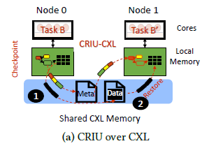
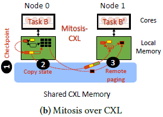
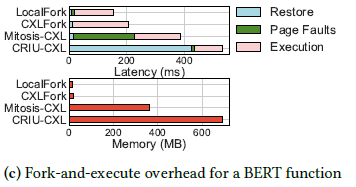

+++
title = "CXLfork: Fast Remote Fork over CXL Fabrics"
[extra]
bio = """ """
[[extra.authors]]
name = "William Davis (Leader / Presentor)"
[[extra.authors]]
name = "Carlos Alvarado-Lopez (Leader / Presentor)"
[[extra.authors]]
name = "Suvrojyoti Paul (scribe)"
[[extra.authors]]
name = "James S. Tappert (blogger)"
+++

## Introduction
The rise of FaaS computing (Function as a Service) has brought the issue of "cold starts" to the forefront of distributed systems research. When a function is invoked in a FaaS workload, the overhead of initializing its state can lead to significant latency. While local fork strategies can mitigate this on a single node, scaling across a cluster traditionally requires slower and memory-intensive remote cloning processes.

The paper *CXLfork: Fast Remote Fork over CXL Fabrics* introduces a novel remote fork interface designed for the emerging Compute Express Link (CXL) interconnect. By leveraging CXL's ability to provide shared, byte-addressable remote memory, CXLfork achieves near-zero serialization and zero-copy process cloning across remote nodes.
## Background and Motivation

### CXL's Advantage

The authors analyzed the access patterns of common FaaS workloads and categorized the data accesses into 3 types:
- **Init:** Data that is used for function initialization and is rarely accessed during execution.
- **Read-only:** Data that is only read during function execution.
- **Read/Write:** Data that is both written and read during function execution.

The results depicted above showed that on average the *Init* and *Read-only* functions made up the bulk of the memory footprint, being responsible for 72.2% and 23% of the footprint, respectively. These findings imply that remote forks can benefit significantly from storing the common states of the *Init* and *Read-only* functions in a CXL shared memory. Allowing cluster-wide memory deduplication and potentially increasing the number of function instances that can be run on a fixed local memory budget.

### Limitations of Existing Remote Fork Technologies
The paper analyzes two existing remote fork mechanisms, ***CRIU*** (*Checkpoint and Restore In Userspace*) and ***Mitosis***, and evaluates their performance when adapted to use shared CXL memory. 

#### ***CRIU:***
Referred to as a "*state-of-practice*" framework, ***CRIU*** does not utilize a cluster's network fabric. Instead, to create a remote fork, it uses Protocol Buffers to indirectly copy a process' state from one node to another through a serialization-deserialization process. The authors adapted this framework to CXL by caching the serialized OS state in shared CXL memory during the *checkpoint* phase and then deserializing to the target node during the *restore* phase. This process is shown in the image below:

#### ***Mitosis:*** 
Referred to as a "*state-of-the-art*" framework, ***Mitosis*** utilizes the cluster's network fabric RDMA capabilities to accelerate the remote forking process. OS state is transferred similarly to ***CRIU's*** serialization-deserialization process, just using one-sided RDMA opererations to transfer the serialized OS state instead. The main difference from ***CRIU*** being the forked process is executed without the parent process' memory pages available. This causes special page faults to trigger that will copy the required pages via remote paging. The authors adapted ***Mitosis*** to support CXL by replacing the RMDA operations with page copies over the shared CXL memory. The remote page faults and OS state transfers are also served through the CXL memory. This process is shown in the image below:

#### BERT Function Evaluation
These adaptations were evaluated by comparing the latency and memory usage during BERT function execution:

The authors found that ***CRIU's*** *restore* phase latency alone was 2.7x longer than the entirety of a local fork equivalent. Furthermore, ***CRIU's*** memory overhead was found to be 42x greater than a local fork. For ***Mitosis*** the findings were slightly better, but the latency overhead was still 2.6x longer than a local fork, and memory usage was 24x greater. 

These findings were the main motivations for designing a new remote fork interface for CXL fabrics. 

## Design of CXLfork

***CXLfork*** addresses the challenges of remote cloning through three innovations:

**1. Checkpointing** 

Instead of converting process state into a portable file format, ***CXLfork*** checkpoints process data and OS structures (like page tables) to CXL memory exactly as they are. To allow different OS instances to use these structures, CXLfork will rebase their internal pointers to index the CXL physical memory address space. This checkpointed data can then be referenced by any node connected to the CXL shared memory.

  
 **2. Zero-Copy State Sharing** 
 
 CXLfork is able to avoid copying process data when requested by a forked node. It does this by mapping the checkpointed data as read-only into the new process' adress space and only initializing the upper levels of the page table tree of the new process in local memory. When a process must write to the checkpointed data, a CoW (Copy on Write) fault is triggered and data is copied to the node's local memory. This allows the majority of a process' data to remain shared and deduplicated across the cluster.
 

  
**3. Tiering Policies** 

To manage the latency overhead of CXL memory, CXLfork provides three different tiering policies for copying read-only data to local memory:
  - **Migrate-on-Write:** Localizes only the data that is being modified.
  - **Migrate-on-Access:** Localizes pages as they are accessed to minimize future CXL latency.
  - **Hybrid Tiering:** Uses hardware "access" (A) bits to identify and proactively migrate "hot" pages to local memory.

### CXLporter: FaaS Optimization

The authors also developed CXLporter, an autoscaler that utilizes CXLfork to manage serverless functions. It maintains a pool of "ghost containers", which are empty shells that consume no CPU or local memory until a function is cloned into them on-demand via CXLfork. This approach allows for rapid scaling during load spikes without the memory pressure of keeping many "warm" containers idle.

## Evaluation and Results

The authors evaluated CXLfork on a dual-socket 64-core Intel Sapphire Rapids server with an FPGA-based CXL memory device. Key findings include:

**Latency:**
-  CXLfork was found to be 2.26x faster than CRIU-CXL and 1.40x faster than Mitosis-CXL on average, and only 14% slower than a standard local fork.
- CXLfork execution is 11x faster than a typical "cold" start.
    
    
**Memory Efficiency:**
- Local memory consumption was reduced by 87% compared to CRIU and 61% compared to Mitosis.
    

## Class Discussion
!!! Need Scribe Notes !!!

## Conclusion

This paper only looked at the specific case of remote forking of processes, illustrating the ineffectiveness of existing remote fork methods and how CXL memory fabrics can offer significant improvements to FaaS workloads. I'm very curious as to what other cluster interfaces can be improved by CXL fabrics, and I view it as one of the most promising technologies to be developed in recent years. The fact that CXL is built off of the already existing PCIE protocol only adds to the possibilities. Overall, I feel like this paper did a great job presenting a specific way that new CXL memory technologies can greatly improve our existing systems.

## References

- Alverti, C., et al. [*CXLfork: Fast Remote Fork over CXL Fabrics (ASPLOS '25*)](https://tianyin.github.io/pub/cxlfork.pdf)

# Generative AI Disclosure
* Gemini was used to generate a Markdown file template and to check spelling and grammar.
