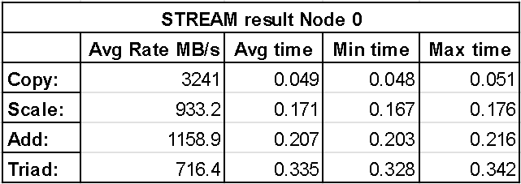
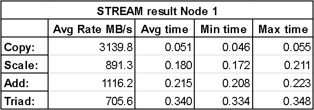
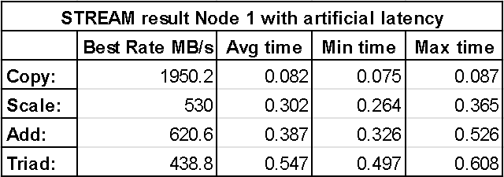
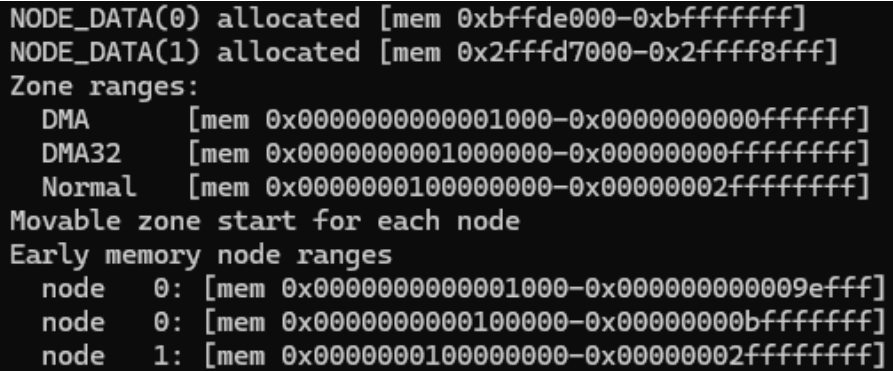
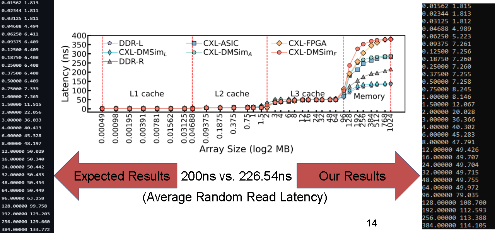
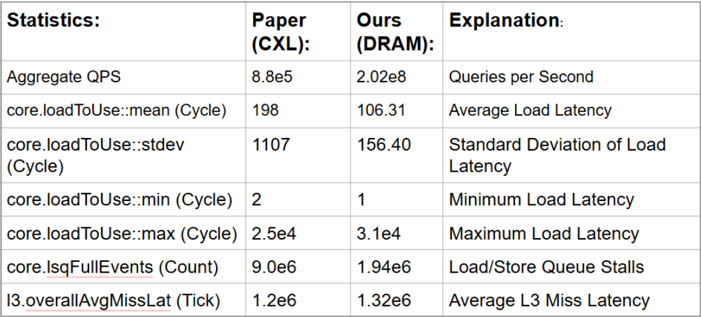

+++
title = "Group 13: CXL Controller on an FPGA"
[extra]
[[extra.authors]]
name = "Mykyta Synytsia"
[[extra.authors]]
name = "James Tappert"
+++

# Project Proposal
Our original project proposal was to implement a Type3 CXL.mem controller on an FPGA to benchmark access latencies against on-chip DRAM and external CXL memory. However, we encountered hardware constraints early on, as our on-hand DE10-Lite FPGA boards lacked PCIe support, and PCIe compatible FPGAs proved to be far too expensive.

Due to this hardware constraint, we shifted our focus to validating results from modern CXL simulators. Local execution of simulation code proved unfeasible due to high memory requirements, and while we explored using OSU's Babylon server, the inability to obtain root access for VM configuration made this non-viable as well. Ultimately, we opted to obtain a compute node lease through the Chameleon cloud computing platform to perform our evaluations.

We explored three candidates for running CXL simulations:

# Candidate 1: QEMU-based Simulations
## Setup
The first candidate we explored was a QEMU-based simulation.

### QEMU
In an attempt to emulate CXL latencies within QEMU a modified version of QEMU was used which had built in support for CXL emulation (https://gitlab.com/jic23/qemu). This also required using a kernel image which had support for CXL, for this the noble-server-cloudimg-amd64 image was used. Apart from the boot script, all the remaining setup and the experiments themselves were done in the guest VM running on Ubuntu 24.04.

### Memory Mapping
The initial approach was to set up a CXL memory region within the guest by using the cxl create-region command, unfortunately this did not seem to work. Therefore we resorted to modifying the VM boot script to use two NUMA nodes and split the memory into two regions.
- Node 0: A 4GB Node attached to all 4 CPUs for main memory
- Node 1: A CPU-less 2GB Node interpreted as external memory

### Simulation
The benchmark used for the experiment was the STREAM benchmark with array sizes of 10 million elements. Two runs were done with the benchmark, the first run was configured to use Node 0, and the second used Node 1. This allowed us to measure bandwidth and latency between the two nodes.

Another experiment was run with added artificial latency to Node 1 and was done with stress-ng to generate traffic on Node 1 in the background. The same STREAM benchmark was run again.

## Results
### No Artificial Latency
The following two figures show results from the STREAM benchmark with memory bound to node 0 (first) and node 1 (second). These results show the average bandwidth, average time, minimum time and maximum time for each of the four operations performed by STREAM. It can be seen that Node 0 achieves higher bandwidth across each operation, however the difference is still fairly insignificant which is especially noticeable with the copy operation. This is further shown by the average time it took the entire vector operation to be performed with Node 1 having slightly larger numbers.

### With Artificial Latency
The result of adding artificial latency to Node 1 with stress-ng is shown in the figure below. With this added latency, the bandwidth is significantly reduced by a factor of approximately 1.66x with respect to Node 0. Additonally, it can be seen that the average, minimum and maximum time is also increased by approximately the same factor of 1.66x.

## Challenges
The most challenging aspect of getting the QEMU simulation running was actually creating a CXL region. We were stuck on this step for hours trying numerous approaches in an attempt to resolve the problem, but ended up switching to a different approach of setting up two NUMA nodes. This issue is likely due to the kernel image used for the experiment.

# Candidate 2: CXLMemSim
As opposed to cycle-accurate simulators like Gem5 and QEMU that require full-system emulation, CXLMemSim operates by attaching itself to unmodified applications and injecting artificial delays to simulate CXL related memory delays.This allows developers to gather performance data in a significantly shorter amount of time, on average 15x faster than a Gem5 equivalent simulation. However, since the simulation relies upon predetermined delay injections that occur based on memory accesses, CXLMemSim at best can only provide rough approximations, and is limited to only latency performance metrics.

## Challenges
To perform these simulations we needed to compile and run the CXLMemSim application alongside a benchmark application on a Linux/86 system. Due to a lack of detailed system requirements we ran into linkage errors when compiling the main CXLMemSim executable. We tried different Linux versions as well as different compilers to no avail, so we were unable to evaluate CXLMemSim's results and functionality.

# Candidate 3: CXLDM-Sim
CXLDM-Sim is a Gem5 based platform capable of full-system, single host emulation. Since it is built off of Gem5, there is a lot of potential for simulating different memory types and CPU cache hierarchies. The main hurdle for this approach is the huge amount of time and processing power required by the simulation.

## Setup
To perform the memory intensive simulations of CXLDM-Sim, we leased a cloud computing node from chameleoncloud.org with 2 Intel Xeon Gold 6240R CPUs and 192GB RAM. Within the SimCXL Gem5 code, we configured a full-system simulation with 3GB on-chip DRR4 and 8GB CXL memory expansion.

## Challenges
Due to the novel nature of CXL technologies and their support on modern Linux kernels we were unable to get the Gem5 VM to recognize the emulated 8GB of CXL memory. Due to this, we were unable to run any CXL related simulations. This was a huge setback, but we were still able to conduct the DRAM tests that the paper used as benchmarks for their CXL results.

## Result
We were able to conduct two DRAM related simulations, LMBench and Merci:

### LMBench

We ran the LMBench DRAM test script provided by CXLDM-Sim, with a max array size of 1024 and a stride length of 64. Our results showed an average DDR4 random read latency of 226.54ns compared against the paper's stated value of 200ns.

### Merci
We also ran a DRAM exclusive 48 CPU Merci workload and compared our DRAM results with the paper’s provided values generated from a CXL configuration.

# What Was Surprising?
Although CXL is a very modern protocol it was surprising to see that there seems to be very little opensource material for testing and verification. Additionally, it was surprising that the papers we looked at for verification didn't have a clear guide on how to run their experiments and verify results, and the ones that did either didn't provide the entire source code or had a faulty implementation.

# Was It A Success?
Our project was a success in terms of technical learning and baseline data collection, though it fell short of its initial goals. We encountered persistent hurdles with CXL simulation models that led to several pivots in project focus. However, we didn't walk away completely empty-handed. We successfully gathered DRAM benchmark data and emulated a dual-node NUMA environment to capture performance and latency metrics. In hind-sight, if we were to do this project again, it would have been better to decide upon a single model like DM-Sim and spend the entire term working out the issues specific to that model, instead of trying out lots of different simulation models and constantly pivoting focus.

## References
- [Chameleon Cloud](https:/chameleoncloud.org/about/chameleon/)
- [CXLDM-Sim](https://arxiv.org/pdf/2411.02282v4)
- [CXLMemSim](https://arxiv.org/pdf/2303.06153)
- [QEMU](https://gitlab.com/jic23/qemu)

# Division Of Responsibilities
QEMU Emulation - Mykyta Synytsia

CXLDM-Sim - James Tappert
